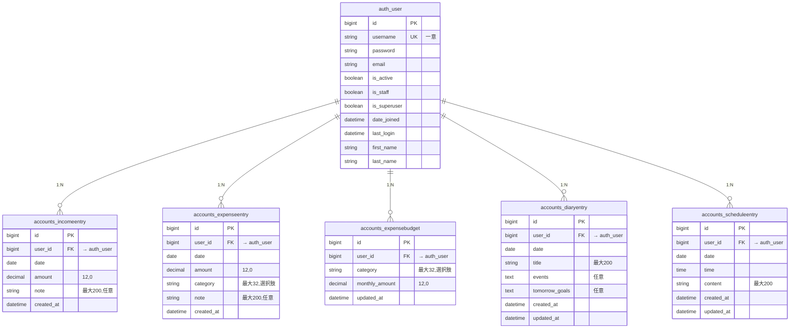

# データベース設計（テーブル定義・ER 図）

本プロジェクトは SQLite（`db.sqlite3`）。業務データは `accounts` アプリのモデルが `auth_user`（Django 標準ユーザー）を参照する形で構成されています。

Django が自動作成する `django_migrations`・`django_session`・`django_admin_log`・`auth_group` などは、ここでは **業務に直接関わるテーブル** に絞って記載します。

---

## テーブル一覧

| 物理テーブル名 | モデル（論理名） | 説明 |
|----------------|------------------|------|
| `auth_user` | `User` | ログインユーザー（Django 標準） |
| `accounts_incomeentry` | `IncomeEntry`（収入） | 収入の取引明細 |
| `accounts_expenseentry` | `ExpenseEntry`（支出） | 支出の取引明細 |
| `accounts_expensebudget` | `ExpenseBudget`（支出予算） | ユーザー×カテゴリ単位の月間予算 |
| `accounts_diaryentry` | `DiaryEntry`（日記） | 日記エントリ |
| `accounts_scheduleentry` | `ScheduleEntry`（予定） | 予定エントリ |

---

## ER 図

GitHub や VS Code（Mermaid 対応プレビュー）でレンダリングできます。

**関係の意味**

- すべて `auth_user` に対して **多（N）** 側が `accounts_*`。**ユーザー削除時は CASCADE** で関連行も削除（`on_delete=CASCADE`）。

---

## カラム定義（詳細）

### `auth_user`（Django `contrib.auth`）

| カラム | 型（概略） | NULL | 備考 |
|--------|------------|------|------|
| `id` | BIGINT PK | NO | 自動採番 |
| `password` | VARCHAR | NO | ハッシュ保存 |
| `last_login` | DATETIME | YES | |
| `is_superuser` | BOOLEAN | NO | 既定 false |
| `username` | VARCHAR(150) | NO | **UNIQUE** |
| `first_name` | VARCHAR(150) | NO | 既定空 |
| `last_name` | VARCHAR(150) | NO | 既定空 |
| `email` | VARCHAR(254) | NO | ログイン時にメールでユーザーを特定 |
| `is_staff` | BOOLEAN | NO | 管理サイト用 |
| `is_active` | BOOLEAN | NO | |
| `date_joined` | DATETIME | NO | |

※実際の最大長は Django / DB バックエンドの定義に従います。

---

### `accounts_incomeentry`（収入）

| カラム | 型（概略） | NULL | 備考 |
|--------|------------|------|------|
| `id` | BIGINT PK | NO | |
| `user_id` | BIGINT FK → `auth_user.id` | NO | `related_name=income_entries` |
| `date` | DATE | NO | 取引日 |
| `amount` | DECIMAL(12,0) | NO | 金額（円想定） |
| `note` | VARCHAR(200) | NO | `blank=True` のため空文字可 |
| `created_at` | DATETIME | NO | 作成日時（自動） |

**インデックス**: Django は FK にインデックスを付与。

**並び順（アプリ）**: `-date`, `-created_at`, `-id`

---

### `accounts_expenseentry`（支出）

| カラム | 型（概略） | NULL | 備考 |
|--------|------------|------|------|
| `id` | BIGINT PK | NO | |
| `user_id` | BIGINT FK → `auth_user.id` | NO | `related_name=expense_entries` |
| `date` | DATE | NO | |
| `amount` | DECIMAL(12,0) | NO | |
| `category` | VARCHAR(32) | NO | `ExpenseBudget.Category` と同一選択肢 |
| `note` | VARCHAR(200) | NO | 空文字可 |
| `created_at` | DATETIME | NO | |

**カテゴリ値（コード値）**: `rent`, `food`, `utilities`, `social`, `communication`, `daily_goods`, `transport`, `medical`, `insurance`, `education`, `other`

**並び順**: `-date`, `-created_at`, `-id`

---

### `accounts_expensebudget`（支出予算）

| カラム | 型（概略） | NULL | 備考 |
|--------|------------|------|------|
| `id` | BIGINT PK | NO | |
| `user_id` | BIGINT FK → `auth_user.id` | NO | `related_name=expense_budgets` |
| `category` | VARCHAR(32) | NO | 上記と同じ選択肢 |
| `monthly_amount` | DECIMAL(12,0) | NO | 月間予算額 |
| `updated_at` | DATETIME | NO | 更新のたびに自動更新 |

**制約**

- **UNIQUE** `(user_id, category)` — 制約名 `accounts_expensebudget_user_category_uniq`（同一ユーザー・同一カテゴリは 1 行）

**並び順**: `category`

---

### `accounts_diaryentry`（日記）

| カラム | 型（概略） | NULL | 備考 |
|--------|------------|------|------|
| `id` | BIGINT PK | NO | |
| `user_id` | BIGINT FK → `auth_user.id` | NO | `related_name=diary_entries` |
| `date` | DATE | NO | 日記の日付 |
| `title` | VARCHAR(200) | NO | |
| `events` | TEXT | NO | `blank=True` |
| `tomorrow_goals` | TEXT | NO | `blank=True` |
| `created_at` | DATETIME | NO | |
| `updated_at` | DATETIME | NO | 保存のたびに更新 |

**並び順**: `-date`, `-created_at`, `-id`

**備考**: 同一ユーザー・同一 `date` に複数行が存在し得る（アプリ側で複数件を扱う）。

---

### `accounts_scheduleentry`（予定）

| カラム | 型（概略） | NULL | 備考 |
|--------|------------|------|------|
| `id` | BIGINT PK | NO | |
| `user_id` | BIGINT FK → `auth_user.id` | NO | `related_name=schedule_entries` |
| `date` | DATE | NO | 予定の日付 |
| `time` | TIME | NO | 予定の時間 |
| `content` | VARCHAR(200) | NO | 予定内容 |
| `created_at` | DATETIME | NO | |
| `updated_at` | DATETIME | NO | 保存のたびに更新 |

**並び順**: `date`, `time`, `id`

---

## 参照

- モデル実装: `accounts/models.py`
- 主キー: 全テーブル `BigAutoField`（`DEFAULT_AUTO_FIELD` 設定に準拠）
